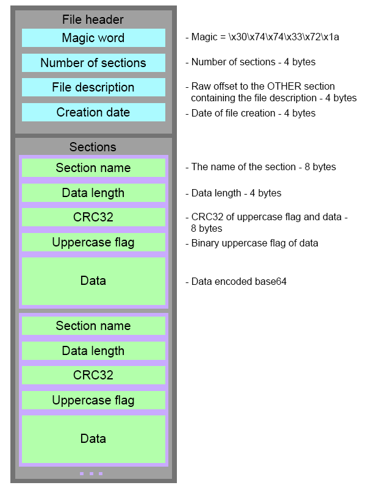
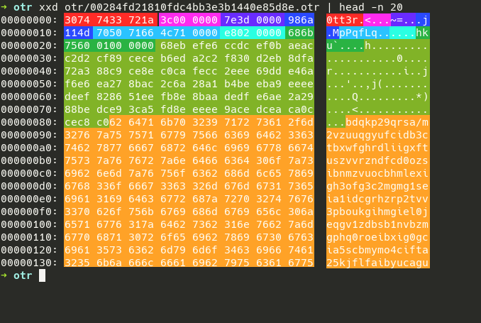
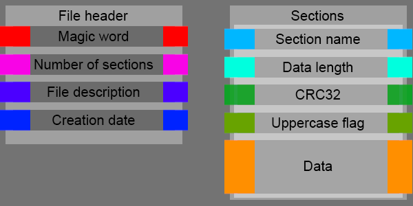

# Otter CTF

I had a blast participating in otter ctf last weekend. I think the challenges are still up at [https://otterctf.com/](https://otterctf.com/)

# OTR 1 - Find The Lutra
```
OTR 1 - Find The Lutra
100
Rick created this new format of file called OTR (stands for otter). Help us find all the hidden data in this massive zip file.

We found a diagram of the structure, we hope it will help.

Your first mission is to find the name of the file who has a section named lutra in leet.

format: CTF{flag}
```

Weird format. I had to understand this weird format. Well i had some time to spare and it looked like lots of fun. so I dug in.



magic header, number of sections. you get all that jazz. ez. (check out parse.py) but i got stuck on the sections. because at first I tought that the length was wrong. somehow. so i coded a part where I was looking for the `\x00` padding.

mhhm i can explain it better with an image. look down

```bash
xxd otr/00284fd21810fdc4bb3e3b1440e85d8e.otr | head -n 20
```





- Section Name: alphanumeric with `\x00` padding
- Data Length: little endian format. `e8020000` => `0xe8 + 0x02 * 0x100 = 744`
- CRC32: actually this had two formats. `686b7560 01000000` and `686b7560 00000000`. `crc32_type1 == -zlib.crc32(data) and crc32_type0 == 0x10000000 - zlib.crc32(data)`
- Uppercase flag: i named it header in `parse.py`.
- data: base64 for all sections except for `OTHER`. used the magical `if`

we had this section for otr7
```
'name': 'OTHER\x00\x00\x00',
'crc32': 408173329,
'crc32_type': 1,
'uppercase_flag': '\x82I\x00',
'data': 'wh3r3_is_my_plum8u5\x00\x00\x00\x00\x00'
```

the uppercase flag is `\x82I\x00` which is equal to `10000010 01001001 00000000`

```
100000100100100100000000
wh3r3_is_my_plum8u5
------------------------
Wh3r3_Is_My_PluM8u5
```

tadaa. uppercase flag decryptor. ok general overview is over.

to solve this task, i actually wasn't able to decode the format (yet). but i understood how the section name was formed. task description said " look for lutra in leet". so in this case it would be "lutra\x00\x00\x00". 3 null bytes padding. used a hamming distance to check (maybe it still has u or r). also checked if it printable and that the length should be > 0. found it quickly enough by analyzing the found names.

```bash
$ python2 solve1.py
...
otr/1275046872ee1058329b79438b14b5dc.otr Rhpr
otr/1275046872ee1058329b79438b14b5dc.otr vuMQf
otr/f879c5f2834e5e97e304b5b1a3f3e5f6.otr OXtma
otr/f879c5f2834e5e97e304b5b1a3f3e5f6.otr Dfti
otr/f879c5f2834e5e97e304b5b1a3f3e5f6.otr lkwH
otr/f879c5f2834e5e97e304b5b1a3f3e5f6.otr Rzty
otr/62c1249e9cd23ed1ee6e29c1267cc47d.otr kUerl
otr/62c1249e9cd23ed1ee6e29c1267cc47d.otr XbHrh
otr/62c1249e9cd23ed1ee6e29c1267cc47d.otr nuy=
otr/a358f694d1e5113ccd1a9ad7f1385549.otr Lu7r4
otr/bf6782f225c82a4906075c1fb1842b51.otr FKtMg
otr/bf6782f225c82a4906075c1fb1842b51.otr JUyFa
otr/bf6782f225c82a4906075c1fb1842b51.otr bvcr
otr/2701a122bbae3770daac5460683b1e30.otr aupo
otr/2701a122bbae3770daac5460683b1e30.otr NAtJ
...
$ # CTF{a358f694d1e5113ccd1a9ad7f1385549}
```

# OTR 6 - The Path To Rick
```
OTR 6 - The Path To Rick
150
Rick hid his drive path in one of the sections - we got some intel and found out his drive is N:. Whats the section name where the data is hidden?

format: CTF{flag}
```

NO WAY IT WAS SOLVED WITH THAT BASH SCRIPT BELOW. well yes. and it helped me to understand the format better. here is where i got the idea that `len(uppercase_flag) == len(data)/8` and after a bit i understood how to decrypt it. by just watching the logs form. lots of logs on this one :))

also if you want to see a failed try, check the `main.py`. i first thought the drive path would be in the data segment. no way it would be in the `uppercase_flag`.

```bash
for v in `grep -r 'N\:' otr | awk '{print $3}'`; do
  echo $v
  xxd $v | grep -C10  'N:'
  echo
done
```

# OTR 5 - Wrong Place, Wrong Time
```
OTR 5 - Wrong Place, Wrong Time
100
One of the files got the wrong time of creation. What is the wrong date?

If you extracted the files from the zip use modified time instead.

format: CTF{HH:MM:SS DD/MM/YYYY at Jerusalem local time}
```

this took me a bit to figure out. the thing is, some do differ in creation time by 1 second. i had to rule that out. and others by 3600 seconds. ruling that out too. then some by 3601. finally i got the flag.

```bash
$ python2 solve5.py
...
1270 otr/a903e65bd79e3c2cdbcbf5cc51478147.otr
1271 otr/44b2f36604d1ca6ff7f0d6b46f95c85d.otr
44b2f36604d1ca6ff7f0d6b46f95c85d
CTF{08:27:12 15/08/1995}

```

# OTR 7 - Wrong Calculation
```
OTR 7 - Wrong Calculation
100
FInd the description of the file with the wrong md5. The flag is case sensitive so you got to use the "uppercase flag" in order to get the correct answer.

format: CTF{flag}
```

explanation way above for the uppercase decryption. also in source of solve.py

```bash
$ python2 solve.py
...
642 otr/e3c991061dcd0add2f669be17bf8539d.otr
e3c991061dcd0add2f669be17bf8539d
{'header_length': 3, 'name': 'OTHER\x00\x00\x00', 'data_length': 24, 'length': 47, 'header': '\x82I\x00', 'actual_crc32': 408173329, 'crc32': 408173329, 'crc32_type': 1, 'data': 'Wh3r3_Is_My_PluM8u5\x00\x00\x00\x00\x00'}
```

# OTR 2 - Incorrect CRC
```
OTR 2 - Incorrect CRC
150
Second mission: Rick copied the CRC of one of the sections in a certain file to another section. What is the name of the original section with the right CRC?

format: CTF{flag}
```

I wish my solution was as slick as the solution shown below. First of all, I was under the impression that Rick copied the CRC of one of the sections in the same file. So I put up some asserts and when it raised, I checked the file. No luck, both times, because the crc was from another file. That was my next tought, so i just searched for the crc in all files.

```bash
$ python2 solve2.py
0
got otr/e0e4b95aac5365c800f304a31985889a.otr
[*] crc32 data: c7c455e1
[*] actual crc32: a6688248

100
200
300
400
500
600
700
got otr/d6a4a2ebd4f6418c3b064de26cc06a12.otr
[*] crc32 data: f8ad0ba4
[*] actual crc32: b8cfe1ab

800
900
1000
1100
1200
1300
1400
95 otr/724e1a24829f6132086473a41ff5ba51.otr
rryt\x00\x00\x00\x00

688 otr/724e1a24829f6132086473a41ff5ba51.otr
M0r7y9uy

728 otr/724e1a24829f6132086473a41ff5ba51.otr
WSkr\x00\x00\x00\x00
$ # CTF{M0r7y9uy}
```


# OTR 3 - Up And Down
```
OTR 3 - Up And Down
200
Rick hid some data in the lower\upper part of a section, but that fucked up the real data, could you find it?
```

I was hoping to solve OTR4 by doing this. So I decrypted everything and put it in folders. it's quite fast. because i can use grep easily on them. no OTR4 but looking at the task description for this one i got the idea that the section might look weird ("that fucked up the real data"). so i went searching for anything out of the ordinary and got lucky to find just one file with non printable characters.

```bash
$ python2 solve4.py
$ grep '[^[:print:]]' -r decoded
Binary file decoded/d6a4a2ebd4f6418c3b064de26cc06a12/3_WSkr matches
$ xxd ./otr/d6a4a2ebd4f6418c3b064de26cc06a12.otr | grep -A20 WSkr
00000da0: 0057 536b 7200 0000 00c0 0400 00a4 0bad  .WSkr...........
00000db0: f800 0000 00fc fecf ce3c eba2 f6ae ceee  .........<......
00000dc0: f80e 9eac ecee beee ee7c e82e ffea fcee  .........|......
00000dd0: 0fb8 6ccc 4300 0054 0000 4600 007b 0000  ..l.C..T..F..{..
00000de0: 4400 0030 0000 7500 0062 0000 6c00 0065  D..0..u..b..l..e
00000df0: 0000 5f00 0050 0000 3400 0064 0000 4400  .._..P..4..d..D.
00000e00: 0021 0000 6e00 0039 0000 5f00 0046 0000  .!..n..9.._..F..
00000e10: 5400 0057 0000 2100 007d 0000 4c8e bf9e  T..W..!..}..L...
00000e20: 335f f662 eaad 6fd4 acea dead 2200 8c72  3_.b..o....."..r
00000e30: a6ee 0e6c d97c 6b3f 653b ee22 eacd faea  ...l.|k?e;."....
00000e40: 6efc 2f0a fe3f 3dfd 7c4e 2eaf 6c6f 6476  n./..?=.|N..lodv
00000e50: 7077 756f 2f69 6472 6776 6866 6a6f 6468  pwuo/idrgvhfjodh
00000e60: 767a 7362 6576 7777 2f69 6772 7264 7962  vzsbevww/igrrdyb
00000e70: 6569 6573 2f72 787a 7573 317a 6f72 7a76  eies/rxzus1zorzv
00000e80: 3264 7962 3069 6362 6c65 6362 7571 6a6a  2dyb0icblecbuqjj
00000e90: 3172 7361 317a 656f 6775 7771 676f 6765  1rsa1zeoguwqgoge
00000ea0: 6769 6861 6775 7476 6f7a 6c6b 6763 6d67  gihagutvozlkgcmg
00000eb0: 676a 6672 3579 3064 7669 6365 7973 7962  gjfr5y0dviceysyb
00000ec0: 7269 6667 6769 6361 7771 7438 6769 6475  rifggicawqt8gidu
00000ed0: 6769 6362 6b75 6e72 6873 6679 3169 666a  gicbkunrhsfy1ifj
00000ee0: 7869 687a 756e 7679 337a 7361 2f61 6466  xihzunvy3zsa/adf
$ # CTF{D0uble_P4dD!n9_FTW!}
```

# OTR 4 - Citadel Of Ricks Location
```
OTR 4 - Citadel Of Ricks Location
300
Rick hid the coordinates of the Citadel Of Ricks in the data section of some file. You will need to use the Uppercase flag to decrypt it.

What is the cover name of the citadel?

format: CTF{flag}
```

if you solved it, please hit me up. i offer beer in exchange of a writeup.
